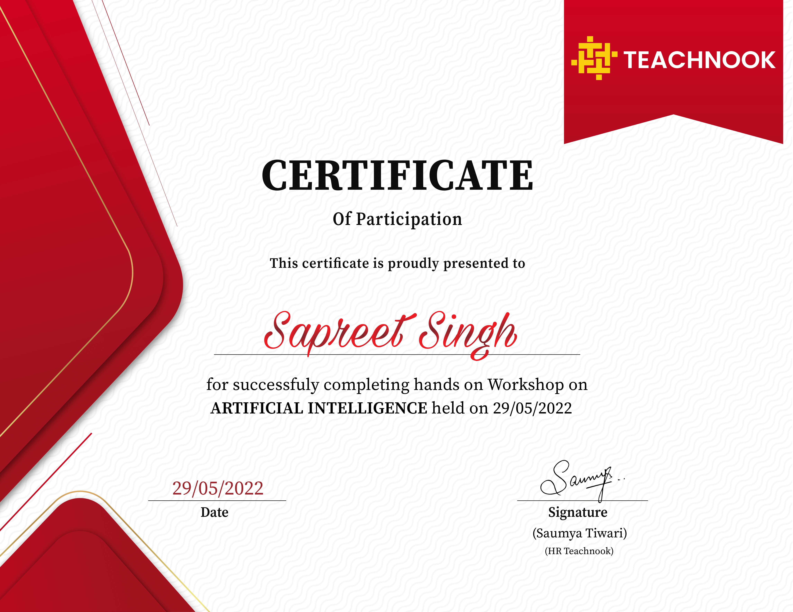
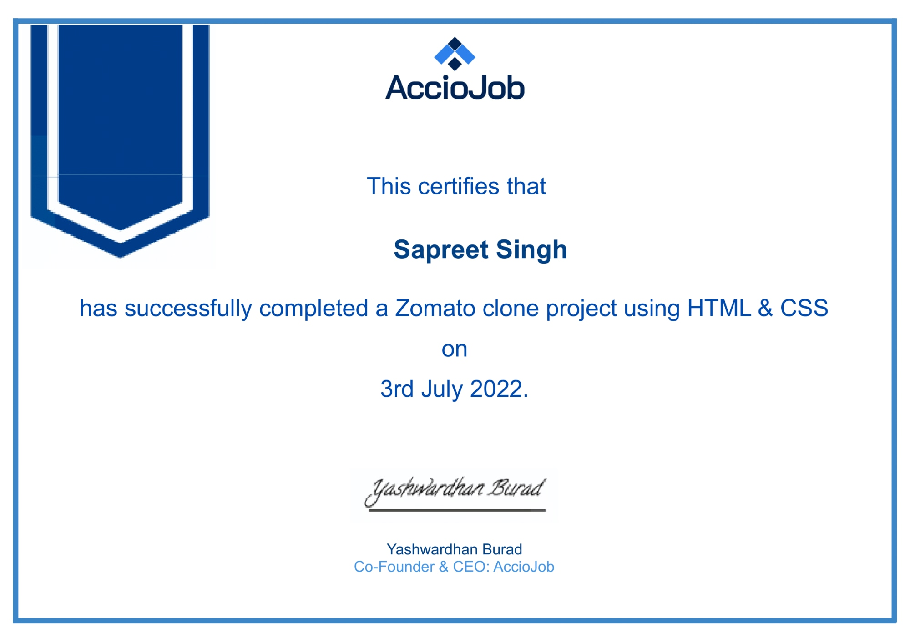
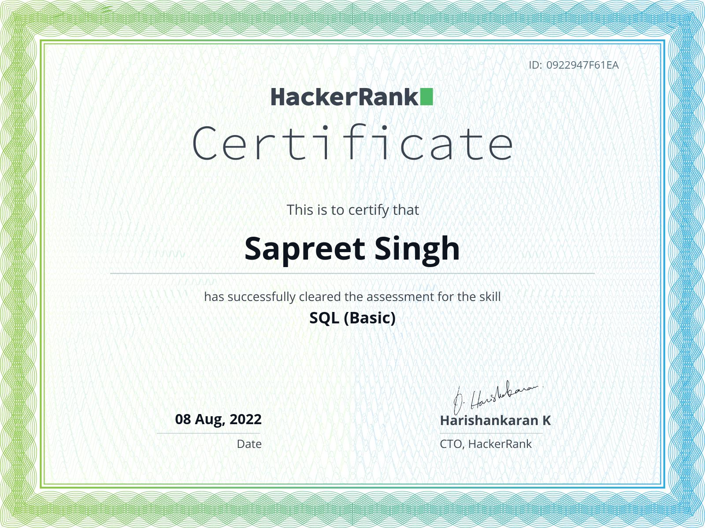

- 👋 Hi, I’m @SapreetGujjar
- 👀 I’m interested in ...
- 🌱 I’m currently learning ...
- 💞️ I’m looking to collaborate on ...
- 📫 How to reach me ...
- Contact NO. +91 90688-40972

 

   
<h1>
  Problem Solving And Analysis
  </h1>
  
   
   
  <h1>
  Python Lagauage Certificates And Workshop
  </h1>
   
  
   
  

   
  <h1>
  Python in Artificial intelligence (AI) Workshop Certificates
  </h1>
   
  
   
  

  <h1>
  Create a Different Programs and Applications: 
  </h1>
  
   
  

   
  <h1>
  Application Lab 
  </h1>
   
  
   
  

   
  <h1>
  Internet of Things (IOT)
  </h1>
   
  
   
  

   
  <h1>
  Live Workshop on Creating a Zomato Clone Using HTML & CSS.
  </h1>
   
  
  

   
  <h1>
  SQL is Used To Communicate With a Database
  </h1>
  
 
   
  

  
  

<!---
SapreetGujjar/SapreetGujjar is a ✨ special ✨ repository because its `README.md` (this file) appears on your GitHub profile.
You can click the Preview link to take a look at your changes.
--->
